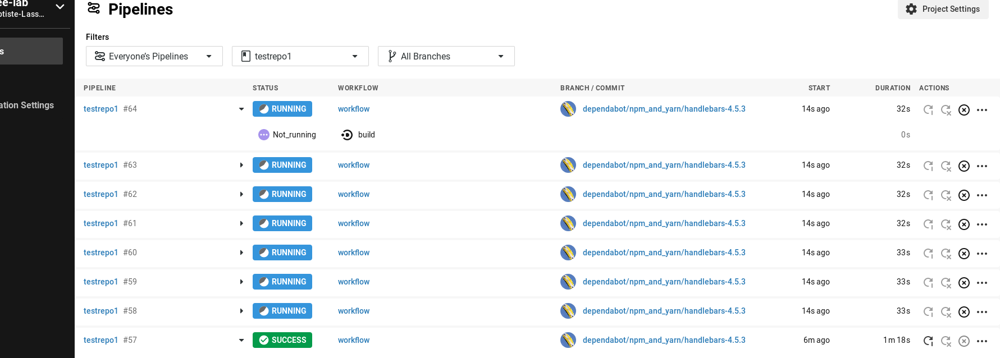

# The Circle CI Conccurrent builds limit

While discussing the `Circle CI` pricing details, we have seen a conccurrent builds limit : not more than 10/20 conccurrent builds.

So the first, most important question is : What happens if we exceed conccurrent builds limit ?

Well here is the answer (pick the `Not_running` mention) :

