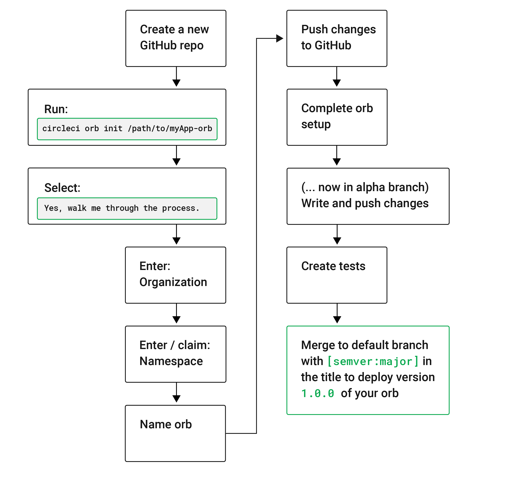

# Orbinoid : A utility to managea proper development Cycle for CircleCI Orbs

`Orbinoïd` is a utility designed to manage a proper development Cycle for CircleCI Orbs :

* packing,
* validating,
* testing,
* deploying to Orb repositry

The Circle CI CLI is a rather dumb utility, and wrapping its command in a
proper `Nodejs` / `Typescript` brings in the whole dev Cycle engineering features along.

## The dev Cycle of an Orb

## How to use

* Fork the `Orbinoid` (later, astarter, project generator)
* place your Circle CI `Orb` `Yaml` files into the `src/orb` Folder
* And then :
  * run `npm run build`, to run the following Orb development Operations :
    * packing,
    * validating,
  * run the `npm run test` to test your Orb (it will be tested with the `./test/.circleci/config.yml`)
  * run the `npm run share` to deploy your Orb to the Orb repository of your Circle CI Server (private or the default public https://circleci.com)

## Install the Circle CI CLI

See `utils/circleci-installation.sh` : an installation script to help / show you how to install the Circle CI CLI.
