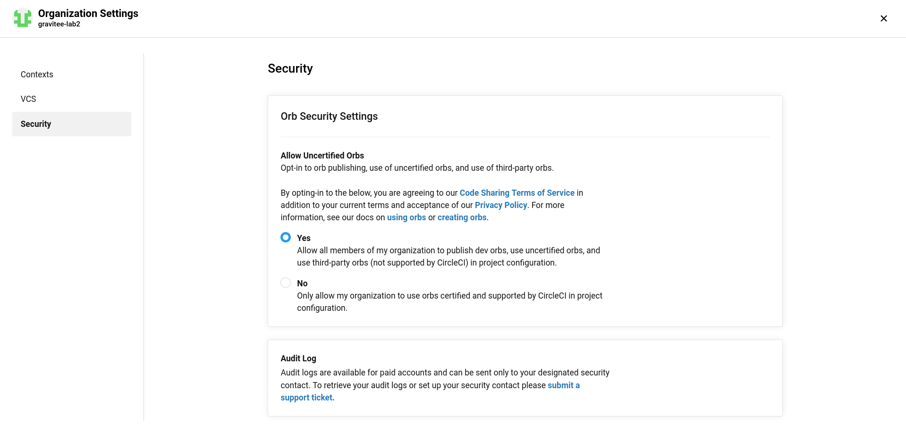

# Orbinoid : A utility to managea proper development Cycle for CircleCI Orbs

`Orbinoïd` is a utility designed to manage a proper development Cycle for CircleCI Orbs :

* packing,
* validating,
* testing,
* deploying to Orb repositry

The Circle CI CLI is a rather dumb utility, and wrapping its command in a
proper `Nodejs` / `Typescript` brings in the whole dev Cycle engineering features along.

## The dev Cycle of an Orb


### Update  : how to create namespace, orb in remote registry, and then publish orb

To publish my orb, without using `circleci orb init` command, The following process worked.

Note that in the process, I never created any git repo on github.com, allthat is important, istaht I have enough Github.com user permissions on the `gravitee-lab` Github Org, used in the below example (or creating the namespace will be unautorized)

* create namespace in remote registry on https://circle.com :

```bash
export ORB_NAMESPACE=orbinoid
export VCS_TYPE=github
export VCS_ORG_NAME=gravitee-lab
circleci namespace create ${NAMESPACE_TO_CREATE} ${VCS_TYPE} ${VCS_ORG_NAME} --no-prompt
```

* output :

```bash
You are creating a namespace called "orbinoid".

This is the only namespace permitted for your github organization, gravitee-lab.

To change the namespace, you will have to contact CircleCI customer support.

✔ Are you sure you wish to create the namespace: `orbinoid`: y
Namespace `orbinoid` created.
Please note that any orbs you publish in this namespace are open orbs and are world-readable.
```

* create orb in remote registry on https://circle.com

```bash
export ORB_NAMESPACE=orbinoid
export ORB_NAME=ubitetorbi
circleci orb create ${ORB_NAMESPACE}/${ORB_NAME} --no-prompt
```
* sample output :

```bash
You are creating an orb called "orbinoid/ubitetorbi".

You will not be able to change the name of this orb.

If you change your mind about the name, you will have to create a new orb with the new name.

✔ Are you sure you wish to create the orb: `orbinoid/ubitetorbi`: y
Orb `orbinoid/ubitetorbi` created.
Please note that any versions you publish of this orb are world-readable.
You can now register versions of `orbinoid/ubitetorbi` using `circleci orb publish`.
```

* and publish the orb to remote registry on https://circle.com :


```bash
export ORB_NAMESPACE=orbinoid
export ORB_NAME=ubitetorbi
export ORB_VERSION=0.0.1
circleci orb publish orb/src/@orb.yml orbinoid/ubitetorbi@0.0.1

```

* sample output :

```bash
Orb `orbinoid/ubitetorbi@0.0.1` was published.
Please note that this is an open orb and is world-readable.
```


Finally, I could find my orb on https://circleci.com at https://circleci.com/developer/orbs/orb/orbinoid/ubitetorbi


## Orbs Dev Cycle Behavior

* if you try and create a namespace, in a remote `Orb` registry, for a given `github` / `bitbucket` Organization (`VCS_ORG_NAME`), if you did not give permissions to acess the organization to the circleci github oauth application, you will get this error :

```bash
=== Creating Circle CI Orb namespace in remote Orb registry
Error: Unable to find organization gravitee-lab2 of vcs-type GITHUB: Must have member permission.: the organization 'gravitee-lab2' under 'GITHUB' VCS-type does not exist. Did you misspell the organization or VCS?
Error Creating Circle CI Orb namespace [orbinoid]
```


* Once you created a namespace, in a remote `Orb` registry, you cannot create any other, for the same github / bitbucket Organization (`VCS_ORG_NAME`) it, if you try to you will get this error :

```bash
=== Creating Circle CI Orb namespace in remote Orb registry
Error: Organizations may only create one namespace. This organization owns the following namespace: "orbinoid"
Error Creating Circle CI Orb namespace [othernamespace]
```
* Once you created a namespace, in a remote `Orb` registry, you cannot create it for any other github / bitbucket Organization (`VCS_ORG_NAME`), if you try to you will get this error :

```bash
=== Creating Circle CI Orb namespace in remote Orb registry
Error: Cannot create namespace 'orbinoid': a namespace with that name already exists.
Error Creating Circle CI Orb namespace [orbinoid]
```

* If you want to create an un-certified `Orb`, in a remote Org registry, for a given `Orb` namespace, you need to authorize un-certified publishing un-certified `Orb`s for your `github` / `bitbucket` Organization (`VCS_ORG_NAME`) in Circle CI serverOrganization settings, or you will get the following error :

```bash
=== Creating Circle CI Orb in remote Orb registry
Error: Your organization must enable the 'Uncertified Orbs' feature in org settings to create orbs
Error Creating Circle CI Orb [gravitee-dev-repos] in remote Orb registry
```




* Once you created a repo, in a remote `Orb` registry, you cannot create any other with the same name, for the same `Orb` namespace. if you try to you will get this error :

```bash
=== Creating Circle CI Orb in remote Orb registry
Error: Cannot create an Orb named 'gravitee-dev-repos': an Orb with that name already exists.
Error Creating Circle CI Orb [gravitee-dev-repos] in remote Orb registry
```

* Once you deployed a version `x.y.z` of an `Orb`, you cannot re-deploy it, if you try to you will get this error :

```bash
=== Publishing Circle CI Orb to remote Orb registry
Error: orb revision already exists
Error Publishing Circle CI Orb [gravitee-dev-repos] in remote Orb registry
```


## How to use

* Fork the `Orbinoid` (later, astarter, project generator)
* place your Circle CI `Orb` `Yaml` files into the `src/orb` Folder
* And then :
  * run `npm run build`, to run the following Orb development Operations :
    * packing,
    * validating,
  * run the `npm run test` to test your Orb (it will be tested with the `./test/.circleci/config.yml`)
  * run the `npm run share` to deploy your Orb to the Orb repository of your Circle CI Server (private or the default public https://circleci.com)


## Install the Circle CI CLI

See `utils/circleci-installation.sh` : an installation script to help / show you how to install the Circle CI CLI.
