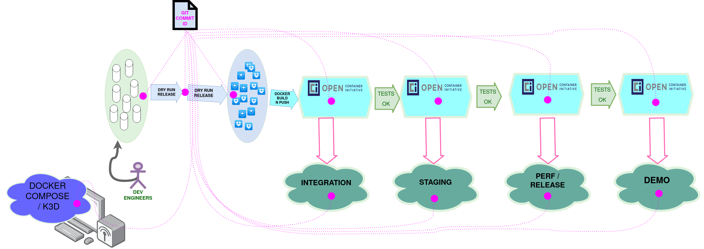

# https://github.com/gravitee-io/gravitee-cockpit

## Step 1 : Pipeline Circle CI version 1

### Analyse rapide du besoin

* les jobs à exécuter :
  * flow 1 : maven release
    * maven test
    * maven build (release..? si c'est rapide) oui maven release,
    * trouver où sont tous les trucs générés : artefacs (dans .m2), zip, et packages npm
    * la git release : à mettre à part, job indépendant
  * flow 2 : les pull request (en snapshot)
    * le orb job pull_request pr_build,

* question 1 : comment ils vont déclencher les 2 flows ?
  * pour moi, c'est plus facile de déclencher un flow avec du gitops,plutôtque du Circle CI token (parce qu'alors, ça demande la gestion des secrets).
* question finale : est-ce qu'on veut faire des déploiements pour les 2 flow ci-dessus ? voir après

### Conception

Je teste avec https://github.com/gravitee-lab/gravitee-cockpit

objectif 1 : faire le build sur master, en

#### Test suite 1 : build direct de `gravitee-cockpit`

* Test 1, on branch `master` of the `gravitee-cockpit` repo :

```bash
# It should be SECRETHUB_ORG=graviteeio, but Cirlce CI token is related to
# a Circle CI User, not an Org, so jsut reusing the same than for Gravtiee-Lab here, to work faster
# ---
SECRETHUB_ORG=gravitee-lab
SECRETHUB_REPO=cicd
# Nevertheless, I today think :
# Each team member should have his own personal secrethub repo in the [graviteeio] secrethub org.
# like this :
# a [graviteeio/${TEAM_MEMBER_NAME}] secrethub repo for each team member
# and the Circle CI Personal Access token stored with [graviteeio/${TEAM_MEMBER_NAME}/circleci/token]
# ---
export HUMAN_NAME=jblasselle
export CCI_TOKEN=$(secrethub read "${SECRETHUB_ORG}/${SECRETHUB_REPO}/humans/${HUMAN_NAME}/circleci/token")

export ORG_NAME="gravitee-lab"
export REPO_NAME="gravitee-cockpit"
export BRANCH="master"
export JSON_PAYLOAD="{

    \"branch\": \"${BRANCH}\",
    \"parameters\":

    {
        \"gio_action\": \"release\",
        \"dry_run\": true,
        \"maven_profile_id\": \"gravitee-dry-run\",
        \"secrethub_org\": \"gravitee-lab\",
        \"secrethub_repo\": \"cicd\"
    }

}"

# dry_run: << pipeline.parameters.dry_run >>
# maven_container_image_tag: stable-latest
# maven_profile_id: << pipeline.parameters.maven_profile_id>>
# secrethub_org: << pipeline.parameters.secrethub_org >>
# secrethub_repo: << pipeline.parameters.secrethub_repo >>

curl -X GET -H 'Content-Type: application/json' -H 'Accept: application/json' -H "Circle-Token: ${CCI_TOKEN}" https://circleci.com/api/v2/me | jq .
curl -X POST -d "${JSON_PAYLOAD}" -H 'Content-Type: application/json' -H 'Accept: application/json' -H "Circle-Token: ${CCI_TOKEN}" https://circleci.com/api/v2/project/gh/${ORG_NAME}/${REPO_NAME}/pipeline | jq .
```

Résultat : il manque une dépendance, `io.gravitee.cockpit:gravitee-cockpit-api:jar:1.1.0-SNAPSHOT`


#### Essai 2 : orchestration à la main

* Idée :

>
> hum... ok, je peux tester un truc :
> * il y a 3 repos, c'est pas bcp
> * je refais exactement ce que je viens de faire avec gravitee-cockpit, mais "j'orchestre à la main" :
>   * d'abord je fais https://github.com/gravitee-io/gravitee-license ,
>   * ensuite je me fais api ,
>   * et après je re-teste gravitee-cockpit
>

Bon, alors à lamain je lis l'arbre de dépendances :

* `gravitee-cockpit` sur master, est en version `3.0.0-SNAPSHOT`
* `gravitee-cockpit` version `3.0.0-SNAPSHOT`, dépend de `gravitee-cockpit-api` version `1.1.0-SNAPSHOT`
* donc je dois release `gravitee-cockpit-api` en version `1.1.0-SNAPSHOT`, donc sur le `master` de `gravitee-cockpit-api`. `1.1.0-SNAPSHOT` est bien laversion de pom sur `master`
* `gravitee-cockpit` version `3.0.0-SNAPSHOT`, dépend de `gravitee-license` version `1.1.2` (cf. `<gravitee-license-api.version>1.1.2</gravitee-license-api.version>`). Donc ilfaut que je build https://github.com/gravitee-lab/gravitee-license sur la branche `1.1.x`


* Release dry run, on branch `master` of the `gravitee-cockpit` repo :

```bash
# It should be SECRETHUB_ORG=graviteeio, but Cirlce CI token is related to
# a Circle CI User, not an Org, so jsut reusing the same than for Gravtiee-Lab here, to work faster
# ---
SECRETHUB_ORG=gravitee-lab
SECRETHUB_REPO=cicd
# Nevertheless, I today think :
# Each team member should have his own personal secrethub repo in the [graviteeio] secrethub org.
# like this :
# a [graviteeio/${TEAM_MEMBER_NAME}] secrethub repo for each team member
# and the Circle CI Personal Access token stored with [graviteeio/${TEAM_MEMBER_NAME}/circleci/token]
# ---
export HUMAN_NAME=jblasselle
export CCI_TOKEN=$(secrethub read "${SECRETHUB_ORG}/${SECRETHUB_REPO}/humans/${HUMAN_NAME}/circleci/token")

export ORG_NAME="gravitee-lab"
export REPO_NAME="gravitee-cockpit"
export BRANCH="master"
export JSON_PAYLOAD="{

    \"branch\": \"${BRANCH}\",
    \"parameters\":

    {
        \"gio_action\": \"release\",
        \"dry_run\": true,
        \"maven_profile_id\": \"gravitee-dry-run\",
        \"secrethub_org\": \"gravitee-lab\",
        \"secrethub_repo\": \"cicd\"
    }

}"

# dry_run: << pipeline.parameters.dry_run >>
# maven_container_image_tag: stable-latest
# maven_profile_id: << pipeline.parameters.maven_profile_id>>
# secrethub_org: << pipeline.parameters.secrethub_org >>
# secrethub_repo: << pipeline.parameters.secrethub_repo >>

curl -X GET -H 'Content-Type: application/json' -H 'Accept: application/json' -H "Circle-Token: ${CCI_TOKEN}" https://circleci.com/api/v2/me | jq .
curl -X POST -d "${JSON_PAYLOAD}" -H 'Content-Type: application/json' -H 'Accept: application/json' -H "Circle-Token: ${CCI_TOKEN}" https://circleci.com/api/v2/project/gh/${ORG_NAME}/${REPO_NAME}/pipeline | jq .
```


* Release, on branch `master` of the `gravitee-cockpit-api` repo :

```bash
# It should be SECRETHUB_ORG=graviteeio, but Cirlce CI token is related to
# a Circle CI User, not an Org, so jsut reusing the same than for Gravtiee-Lab here, to work faster
# ---
SECRETHUB_ORG=gravitee-lab
SECRETHUB_REPO=cicd
# Nevertheless, I today think :
# Each team member should have his own personal secrethub repo in the [graviteeio] secrethub org.
# like this :
# a [graviteeio/${TEAM_MEMBER_NAME}] secrethub repo for each team member
# and the Circle CI Personal Access token stored with [graviteeio/${TEAM_MEMBER_NAME}/circleci/token]
# ---
export HUMAN_NAME=jblasselle
export CCI_TOKEN=$(secrethub read "${SECRETHUB_ORG}/${SECRETHUB_REPO}/humans/${HUMAN_NAME}/circleci/token")

export ORG_NAME="gravitee-lab"
export REPO_NAME="gravitee-cockpit-api"
export BRANCH="master"
export JSON_PAYLOAD="{

    \"branch\": \"${BRANCH}\",
    \"parameters\":

    {
        \"gio_action\": \"release\",
        \"dry_run\": true,
        \"maven_profile_id\": \"gravitee-dry-run\",
        \"secrethub_org\": \"gravitee-lab\",
        \"secrethub_repo\": \"cicd\"
    }

}"

# dry_run: << pipeline.parameters.dry_run >>
# maven_container_image_tag: stable-latest
# maven_profile_id: << pipeline.parameters.maven_profile_id>>
# secrethub_org: << pipeline.parameters.secrethub_org >>
# secrethub_repo: << pipeline.parameters.secrethub_repo >>

curl -X GET -H 'Content-Type: application/json' -H 'Accept: application/json' -H "Circle-Token: ${CCI_TOKEN}" https://circleci.com/api/v2/me | jq .
curl -X POST -d "${JSON_PAYLOAD}" -H 'Content-Type: application/json' -H 'Accept: application/json' -H "Circle-Token: ${CCI_TOKEN}" https://circleci.com/api/v2/project/gh/${ORG_NAME}/${REPO_NAME}/pipeline | jq .
```


* Release, on branch `1.1.x` of the `gravitee-license` repo :

```bash
# It should be SECRETHUB_ORG=graviteeio, but Cirlce CI token is related to
# a Circle CI User, not an Org, so jsut reusing the same than for Gravtiee-Lab here, to work faster
# ---
SECRETHUB_ORG=gravitee-lab
SECRETHUB_REPO=cicd
# Nevertheless, I today think :
# Each team member should have his own personal secrethub repo in the [graviteeio] secrethub org.
# like this :
# a [graviteeio/${TEAM_MEMBER_NAME}] secrethub repo for each team member
# and the Circle CI Personal Access token stored with [graviteeio/${TEAM_MEMBER_NAME}/circleci/token]
# ---
export HUMAN_NAME=jblasselle
export CCI_TOKEN=$(secrethub read "${SECRETHUB_ORG}/${SECRETHUB_REPO}/humans/${HUMAN_NAME}/circleci/token")

export ORG_NAME="gravitee-lab"
export REPO_NAME="gravitee-license"
export BRANCH="1.1.x"
export JSON_PAYLOAD="{

    \"branch\": \"${BRANCH}\",
    \"parameters\":

    {
        \"gio_action\": \"release\",
        \"dry_run\": true,
        \"maven_profile_id\": \"gravitee-dry-run\",
        \"secrethub_org\": \"gravitee-lab\",
        \"secrethub_repo\": \"cicd\"
    }

}"

# dry_run: << pipeline.parameters.dry_run >>
# maven_container_image_tag: stable-latest
# maven_profile_id: << pipeline.parameters.maven_profile_id>>
# secrethub_org: << pipeline.parameters.secrethub_org >>
# secrethub_repo: << pipeline.parameters.secrethub_repo >>

curl -X GET -H 'Content-Type: application/json' -H 'Accept: application/json' -H "Circle-Token: ${CCI_TOKEN}" https://circleci.com/api/v2/me | jq .
curl -X POST -d "${JSON_PAYLOAD}" -H 'Content-Type: application/json' -H 'Accept: application/json' -H "Circle-Token: ${CCI_TOKEN}" https://circleci.com/api/v2/project/gh/${ORG_NAME}/${REPO_NAME}/pipeline | jq .
```

résultat :

>
> * l'erreur précédente est résolue,
> * j'ai une nouvelle erreur, identitique à la précédente, mais cette fois, il manque io.gravitee.identityprovider:gravitee-identityprovider-api:jar:1.1.0-SNAPSHOT
> * j'applique la même solution
>

Ok, mais en fait, je vais directement appliquer cette même solution, sur toutes les dépendances internes gravitee, trouvées dans le `pom.xml` de `gravitee-cockpit`

```xml
<gravitee-license-api.version>1.1.2</gravitee-license-api.version>
<gravitee-node.version>1.10.0</gravitee-node.version>
<gravitee-alert.version>1.5.0</gravitee-alert.version>
<gravitee-plugin.version>1.16.0</gravitee-plugin.version>
<gravitee-common.version>1.18.0</gravitee-common.version>
<gravitee-definition.version>1.22.1</gravitee-definition.version>
<gravitee-cockpit-api.version>1.1.0-SNAPSHOT</gravitee-cockpit-api.version>
<gravitee-identityprovider-api.version>1.1.0-SNAPSHOT</gravitee-identityprovider-api.version>
```

#### Essai 3: simplifiction des dépendances `pom.xml` et identity provider dry release


* git@github.com:gravitee-lab/gravitee-identityprovider-api.git : dry run release the version `1.1.0-SNAPSHOT` on `master` git branch


* Release, on branch `master` of the `gravitee-identityprovider-api` repo :

```bash
# It should be SECRETHUB_ORG=graviteeio, but Cirlce CI token is related to
# a Circle CI User, not an Org, so jsut reusing the same than for Gravtiee-Lab here, to work faster
# ---
SECRETHUB_ORG=gravitee-lab
SECRETHUB_REPO=cicd
# Nevertheless, I today think :
# Each team member should have his own personal secrethub repo in the [graviteeio] secrethub org.
# like this :
# a [graviteeio/${TEAM_MEMBER_NAME}] secrethub repo for each team member
# and the Circle CI Personal Access token stored with [graviteeio/${TEAM_MEMBER_NAME}/circleci/token]
# ---
export HUMAN_NAME=jblasselle
export CCI_TOKEN=$(secrethub read "${SECRETHUB_ORG}/${SECRETHUB_REPO}/humans/${HUMAN_NAME}/circleci/token")

export ORG_NAME="gravitee-lab"
export REPO_NAME="gravitee-identityprovider-api"
export BRANCH="master"
export JSON_PAYLOAD="{

    \"branch\": \"${BRANCH}\",
    \"parameters\":

    {
        \"gio_action\": \"release\",
        \"dry_run\": true,
        \"maven_profile_id\": \"gravitee-dry-run\",
        \"secrethub_org\": \"gravitee-lab\",
        \"secrethub_repo\": \"cicd\"
    }

}"

# dry_run: << pipeline.parameters.dry_run >>
# maven_container_image_tag: stable-latest
# maven_profile_id: << pipeline.parameters.maven_profile_id>>
# secrethub_org: << pipeline.parameters.secrethub_org >>
# secrethub_repo: << pipeline.parameters.secrethub_repo >>

curl -X GET -H 'Content-Type: application/json' -H 'Accept: application/json' -H "Circle-Token: ${CCI_TOKEN}" https://circleci.com/api/v2/me | jq .
curl -X POST -d "${JSON_PAYLOAD}" -H 'Content-Type: application/json' -H 'Accept: application/json' -H "Circle-Token: ${CCI_TOKEN}" https://circleci.com/api/v2/project/gh/${ORG_NAME}/${REPO_NAME}/pipeline | jq .
```

Résultat de tests où j'avais oublié de virer toutes les dépendances dans lessous modules maven :

https://app.circleci.com/pipelines/github/gravitee-lab/gravitee-cockpit/10/workflows/5ed1bd85-4a14-4526-82db-18a014580b5c/jobs/10


* ok, parmi lesdépendances virées, la `gravitee-platform-repository-api` est nécessaire : https://app.circleci.com/pipelines/github/gravitee-lab/gravitee-cockpit/12/workflows/e7e80728-913e-4ac0-8ac0-8823be0d6970/jobs/12 .DOnc :
  * Je ne dois pas faire le release dry run de `gravitee-platform-repository-api` version `1.0.0` car a déjà été releasée
  * je rajoute et je relance
* même chose pour `gravitee-common` en version `1.18.0` : déjà releasée,donc pasdbesoin de faire une release dry run
*


* Release dry run, on branch `master` of the `gravitee-cockpit` repo :

```bash
# It should be SECRETHUB_ORG=graviteeio, but Cirlce CI token is related to
# a Circle CI User, not an Org, so jsut reusing the same than for Gravtiee-Lab here, to work faster
# ---
SECRETHUB_ORG=gravitee-lab
SECRETHUB_REPO=cicd
# Nevertheless, I today think :
# Each team member should have his own personal secrethub repo in the [graviteeio] secrethub org.
# like this :
# a [graviteeio/${TEAM_MEMBER_NAME}] secrethub repo for each team member
# and the Circle CI Personal Access token stored with [graviteeio/${TEAM_MEMBER_NAME}/circleci/token]
# ---
export HUMAN_NAME=jblasselle
export CCI_TOKEN=$(secrethub read "${SECRETHUB_ORG}/${SECRETHUB_REPO}/humans/${HUMAN_NAME}/circleci/token")

export ORG_NAME="gravitee-lab"
export REPO_NAME="gravitee-cockpit"
export BRANCH="master"
export JSON_PAYLOAD="{

    \"branch\": \"${BRANCH}\",
    \"parameters\":

    {
        \"gio_action\": \"release\",
        \"dry_run\": true,
        \"maven_profile_id\": \"gravitee-dry-run\",
        \"secrethub_org\": \"gravitee-lab\",
        \"secrethub_repo\": \"cicd\"
    }

}"

# dry_run: << pipeline.parameters.dry_run >>
# maven_container_image_tag: stable-latest
# maven_profile_id: << pipeline.parameters.maven_profile_id>>
# secrethub_org: << pipeline.parameters.secrethub_org >>
# secrethub_repo: << pipeline.parameters.secrethub_repo >>

curl -X GET -H 'Content-Type: application/json' -H 'Accept: application/json' -H "Circle-Token: ${CCI_TOKEN}" https://circleci.com/api/v2/me | jq .
curl -X POST -d "${JSON_PAYLOAD}" -H 'Content-Type: application/json' -H 'Accept: application/json' -H "Circle-Token: ${CCI_TOKEN}" https://circleci.com/api/v2/project/gh/${ORG_NAME}/${REPO_NAME}/pipeline | jq .
```


Okmaintenant j'ai eut une erreur parceque j'ai release la `gravitee-license` version `1.1.3`,alors que j'ai besoin de la `1.1.2` dans `gravitee-cockpit` :
* Pour cela, j'ai customisé le `config.yml` pour fair eune "back in time release" dans le pipeline de `gravitee-license`, afin de faire la maven release de la `gravitee-license`
* pour ensuite relancer `gravitee-cockpit`


* Maven dry run Release, back in time, of version  `1.1.2` of the `gravitee-license` repo :

```bash
# It should be SECRETHUB_ORG=graviteeio, but Cirlce CI token is related to
# a Circle CI User, not an Org, so jsut reusing the same than for Gravtiee-Lab here, to work faster
# ---
SECRETHUB_ORG=gravitee-lab
SECRETHUB_REPO=cicd
# Nevertheless, I today think :
# Each team member should have his own personal secrethub repo in the [graviteeio] secrethub org.
# like this :
# a [graviteeio/${TEAM_MEMBER_NAME}] secrethub repo for each team member
# and the Circle CI Personal Access token stored with [graviteeio/${TEAM_MEMBER_NAME}/circleci/token]
# ---
export HUMAN_NAME=jblasselle
export CCI_TOKEN=$(secrethub read "${SECRETHUB_ORG}/${SECRETHUB_REPO}/humans/${HUMAN_NAME}/circleci/token")

export ORG_NAME="gravitee-lab"
export REPO_NAME="gravitee-license"
export BRANCH="1.1.x"
export JSON_PAYLOAD="{

    \"branch\": \"${BRANCH}\",
    \"parameters\":

    {
        \"gio_action\": \"martymcfly_mvn_release\",
        \"dry_run\": true,
        \"maven_profile_id\": \"gravitee-dry-run\",
        \"secrethub_org\": \"gravitee-lab\",
        \"secrethub_repo\": \"cicd\"
    }

}"

# dry_run: << pipeline.parameters.dry_run >>
# maven_container_image_tag: stable-latest
# maven_profile_id: << pipeline.parameters.maven_profile_id>>
# secrethub_org: << pipeline.parameters.secrethub_org >>
# secrethub_repo: << pipeline.parameters.secrethub_repo >>

curl -X GET -H 'Content-Type: application/json' -H 'Accept: application/json' -H "Circle-Token: ${CCI_TOKEN}" https://circleci.com/api/v2/me | jq .
curl -X POST -d "${JSON_PAYLOAD}" -H 'Content-Type: application/json' -H 'Accept: application/json' -H "Circle-Token: ${CCI_TOKEN}" https://circleci.com/api/v2/project/gh/${ORG_NAME}/${REPO_NAME}/pipeline | jq .
```


Bien, avec quelques tests supplémentaires, j'ai pu constater qu'il n'y avait aucune dépendance, rien à toucher dans les `pom.xml`.

J'ai donc fait un autre fork, pour reprendre exactemnt le projet sans modif, juste j'ai fait un comit pour ajouter le bon `.circleci/config.yml`, et je teste :


* Release dry run, on branch `master` of the `gravitee-cockpit-2` repo :

```bash
# It should be SECRETHUB_ORG=graviteeio, but Cirlce CI token is related to
# a Circle CI User, not an Org, so jsut reusing the same than for Gravtiee-Lab here, to work faster
# ---
SECRETHUB_ORG=gravitee-lab
SECRETHUB_REPO=cicd
# Nevertheless, I today think :
# Each team member should have his own personal secrethub repo in the [graviteeio] secrethub org.
# like this :
# a [graviteeio/${TEAM_MEMBER_NAME}] secrethub repo for each team member
# and the Circle CI Personal Access token stored with [graviteeio/${TEAM_MEMBER_NAME}/circleci/token]
# ---
export HUMAN_NAME=jblasselle
export CCI_TOKEN=$(secrethub read "${SECRETHUB_ORG}/${SECRETHUB_REPO}/humans/${HUMAN_NAME}/circleci/token")

export ORG_NAME="gravitee-lab"
export REPO_NAME="gravitee-cockpit-2"
export BRANCH="master"
export JSON_PAYLOAD="{

    \"branch\": \"${BRANCH}\",
    \"parameters\":

    {
        \"gio_action\": \"release\",
        \"dry_run\": true,
        \"maven_profile_id\": \"gravitee-dry-run\",
        \"secrethub_org\": \"gravitee-lab\",
        \"secrethub_repo\": \"cicd\"
    }

}"

# dry_run: << pipeline.parameters.dry_run >>
# maven_container_image_tag: stable-latest
# maven_profile_id: << pipeline.parameters.maven_profile_id>>
# secrethub_org: << pipeline.parameters.secrethub_org >>
# secrethub_repo: << pipeline.parameters.secrethub_repo >>

curl -X GET -H 'Content-Type: application/json' -H 'Accept: application/json' -H "Circle-Token: ${CCI_TOKEN}" https://circleci.com/api/v2/me | jq .
curl -X POST -d "${JSON_PAYLOAD}" -H 'Content-Type: application/json' -H 'Accept: application/json' -H "Circle-Token: ${CCI_TOKEN}" https://circleci.com/api/v2/project/gh/${ORG_NAME}/${REPO_NAME}/pipeline | jq .
```


### Premières conclusions

Pour exécuter une release maven / git du produit Cockpit :
* le pipeline circle ci conçut pour tous les dev repos est suffisant, mis à part un cas particulier d'initialisation (gravitee-licence), où l'on doit ré-effectuer dans le artifactory privé, une release déjà efectuée par le passé, et qui n'ets disponible sur aucun repopublic maven.
* aucun problème de gravitee parent pom ne s'est présenté, en mode dry-run : mais un chagement de gravitee parent pomsera nécessaire pour avoir le maven profile `gio-release`, dans le cas d'une release _"non dry-run"_.
* l'objectif étant d'en arriver au déploiement, la release en mode dry run  pourra être suffisant, pour parvenir au déploiement :
  * cependant il est extrêment mauvais, de ne pas correctement "marquer" avec git, une version déployée. Encore que l'on puisse se contenter d'un GIT COMMIT ID :oui, nous le ferons aisnsi au départ.
  * On voit en tout cas que l'on a là un cas où l'on souahite se concentrer sur l'objectif de déploiement, sans se préoccuper d'effectuer une quelqconque release "publique" maven :
    * c'est là que l'on ressent une nécessité de "casser" l'adhérence entre le processus de release maven, et le processus de release git (pour que l'un et l'autre puissent être possible indépendament, et avec une valeur de dry-run différente)
    * ok oui, je vais avoir le process : `mvn_release` toujur endry run, et `git_release` toujours attachée au paramètre de pipeline `dry_run`, encore que ....

* Ok, donc :
  * on ne fait que du dry run release pour obtenir les artefacts maven et les zip
  * on docker build and push sur un docker registry artifactory privé
  * on déploie à partir du container registry privé artifactory
  * on garde une meta data tout le long du pipeline: les git commit id pour chaque dépendance.
  * Donc pour la release dry run , il serait important de pouvoir persister le git commit ID dans le `release.json`, pour toutes les SNAPSHOTS :
    * le git commit id, pour toutes les dépedances qui étaient en `-SNAPSHOT`
    * le git tag est suffisant pour ce qui a été releasé
    * moyen technique optimisé, pour obtenir le dernier hash commit sur une branche donnée :
      * sans faire le git clone (utilsier git fetch) : https://stackoverflow.com/questions/24750215/getting-the-last-commit-hash-from-a-remote-repo-without-cloning
      * pourquoi pas avec la Circle CI API, mais c'est alorsplus complexeen terme d'implémentation, et asynchrone.
    * la persistance de ce commit hash, doit se faire au moment où l'on appose le git start tag (juste après, sans faire de git commit, just eun git add, et les données seront retrouvées avec le git tag de release, non poussé en dry run)
    * donc le release.json , à l'issue de la maven release, doit être envoyé comme manifeste, en tant que chaine de caractères JSON en paramètre de pipelines Circle CI, puis retransformé en fichier JSON, à l'aide de `jq`, pour être embarqué comme manifest dans les images de conteneurs
    * la valeur d'un `LABEL` d'image de conteneur peut être du JSON:
      * référence exemple : https://github.com/Shopify/docker/blob/master/docs/userguide/labels-custom-metadata.md#store-structured-data-in-labels
      * exemple : `LABEL com.example.image-specs="{\"Description\":\"A containerized foobar\",\"Usage\":\"docker run --rm example\\/foobar [args]\",\"License\":\"GPL\",\"Version\":\"0.0.1-beta\",\"aBoolean\":true,\"aNumber\":0.01234,\"aNestedArray\":[\"a\",\"b\",\"c\"]}"`
      * et derrière il suffit de faire un docker inspect du `LABEL` de l'image pour récupérer le JSON
      * Ok, donc c'est bien ce qu'il faut. Ce sera une pahse synchrone de chaque release dry-run, qu'on pourrait apperler le "calcul du manifest" :  ledry run sera donc plus long qu'une non dry run release, ce qui est logique.
      * autre possibilité : on récupère le JSON, et on retrouve dans le JSON, le composant que l'on est en train de traiter, son `component.name`, qui esten fait un ID dansle catalogue des component gravitee. On pourra ici distinguer un GUID pur, du nom de repo git, un jour...?

pour cette histoire de git commit id, .... comment faire une solution vite fait pour Cockpit ?
* on verra, mais à la rigeur, si le git commit id pouvait êtreinclut dans les artefacts maven directement déjà... :
  * exemple pour attacher un fichier custom de metadata dans un artefact maven (au package donc, aucne importantce leserveur cibled du `mvn deploy`)  : `documentation/cockpit/maven/custom-artifacts-metadata/example1` , ref. https://support.sonatype.com/hc/en-us/articles/213465338-How-can-I-add-additional-metadata-to-an-artifact-stored-in-Nexus-
  * pour npm, autant utiliser la technique `include meta files into package`, comme expliqué ici https://nodejs.medium.com/publishing-npm-packages-c4c615a0fc6b ..?
  * au final, la technique suivant me paraît la meileure, pour n'absolument rien toucher au build du développeur (eteux ,c'est sûr dne vont pas arrêter de toucher à leur build) :
    * utiliser le `release.json` comme manifest,
    * l'insérer dans toutes les images de conteneur
    * toute image de conteneur doit aussi pouvoir êtreconsciente des components qu'elle contient,qui sont un sous ensemble des components du `release.json`
    * ok c'est vraiment complexe, si on va au bout ... Ou alors on pourrait simplement avoir un components.json qui est "une rduction du release.json aux seuls composants embarqués dans l'image Docker"
* du cou pourlevite fait pour Cockpit : on voit pas après pas, ce qu'on peut mettre commemetadata, et on avisera, sans jamais compliquer.


## Architecture

<!--  -->


