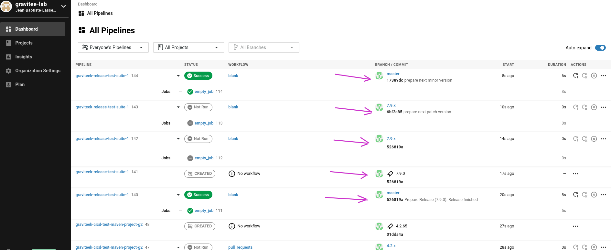

# Description of the Release Process

## On the Release Repo

The release process is different, for a patch release, or for minor release :
* In both cases, the process starts by marking with a git tag the version of the `release.json` which defines the release : using this tag, you can easily retrieve the release.json, and "check all the components which were suffixed with `-SNAPSHOT`", to be released.
* all pipelines are triggered to perform the release, and when all components have been released, or release has stopped because of errors, then:
  * for  all successfully released components, the `-SNAPSHOT` suffix is removed in the `release.json`, and the `git add --all` comamnd is executed
  * the `-SNAPSHOT` suffix is removed from the top version property in the `release.json`, and the `git add --all` comamnd is executed
  * the `release.json` is git commit and pushed to the release repo
  * the release tag is creaed and pushed to the release repo
* At this point, this is where the release process differs, in the case of a patch release, or a minor release

#### Patch release

#### Minor release

The screenshot below demonstratesallthe steps of the release process when it is a minor version :

In the sceeennshot above :
* The first pointed step, is a git push, of a commit which has the commit message `Prepare Release (7.9.0): Release finished`. This commit contains all the modifications to the `release.json`, which are done for any release: removing the `-SNAPSHOT` suffixes, for all successfully released components.
*
