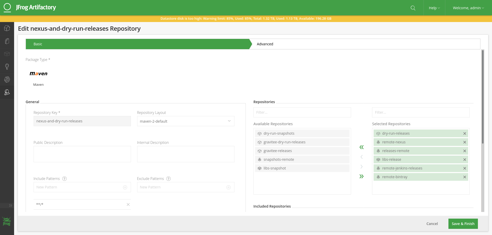
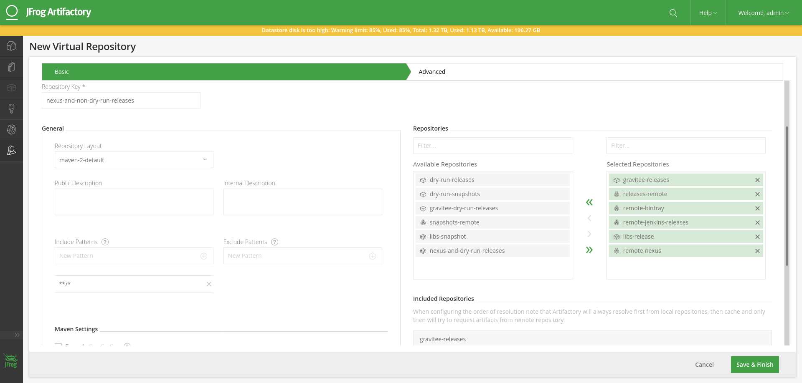

## CICD Secrets taxonomy trees

All CI CD Secrets have to be managed with Secrethub.

The Glocal CI CD system, will run into two isolated worlds :
* the "real world" (production) : where the CI CD System works for the Gravitee.io Team. That's the https
* the "test world" (tests) : where the CI CD System is tested
* isolation is reached at the Github Organization level :
  * 2 completely different Github organizations
  * and therefore 2 completely different secrets taxonomy trees to operate.

With this point of view, the _**The Gravitee Secrets Inventory**_ will therefore have to extensively document those two taxonomy trees.

## CICD Secrets taxonomy tree for https://github.com/gravitee-lab (Tests)


* Secrethub orgs:
  * `gravitee-lab`
* Secrethub repos:
  * `gravitee-lab/cicd`

* secrets :
  * `gravitee-lab/cicd/graviteebot/circleci/secrethub-svc-account/token`: Secrethub Service Account (Robot user) for Circle CI Pipelines (Secrethub / Circle CI integration)
  * `gravitee-lab/cicd/graviteebot/circleci/api/token` : Circle CI Token used by the Gravitee CI CD Orchestrator
  * `gravitee-lab/cicd/graviteebot/circleci/api/.secrets.json` : Circle CI secret file used by the Gravitee CI CD Orchestrator
  * [Gravitee Lab bot](https://github.com/gravitee-lab) `GnuPG` identity :
    * `gravitee-lab/cicd/graviteebot/gpg/user_name`
    * `gravitee-lab/cicd/graviteebot/gpg/user_name_comment`
    * `gravitee-lab/cicd/graviteebot/gpg/user_email`
    * `gravitee-lab/cicd/graviteebot/gpg/passphrase`
    * `gravitee-lab/cicd/graviteebot/gpg/key_id`
    * (file) `gravitee-lab/cicd/graviteebot/gpg/pub_key`
    * (file) `gravitee-lab/cicd/graviteebot/gpg/private_key`
  * [Gravitee Lab bot](https://github.com/gravitee-lab) git config in all Git Service providers (Github, Gitlab, Bitbucket etc...) :
    * `gravitee-lab/cicd/graviteebot/git/user/name` : [Gravitee bot](https://github.com/gravitee-lab) git user name
    * `gravitee-lab/cicd/graviteebot/git/user/email` : [Gravitee bot](https://github.com/gravitee-lab) git user email
    * `gravitee-lab/cicd/graviteebot/git/ssh/private_key` : [Gravitee bot](https://github.com/gravitee-lab) git ssh private key
    * `gravitee-lab/cicd/graviteebot/git/ssh/public_key` :  [Gravitee bot](https://github.com/gravitee-lab) git ssh public key
  * [Gravitee Lab bot](https://github.com/gravitee-lab) artifactory credentials and the multiple `settings.xml` (maven) files used in all CI CD Processes :
    * `gravitee-lab/cicd/graviteebot/infra/maven/dry-run/artifactory/user-name`
    * `gravitee-lab/cicd/graviteebot/infra/maven/dry-run/artifactory/user-pwd`
    * `gravitee-lab/cicd/graviteebot/infra/maven/dry-run/artifactory/snaphots-repo-url`
    * `gravitee-lab/cicd/graviteebot/infra/maven/dry-run/artifactory/dry-run-release-repo-url`
    * `gravitee-lab/cicd/graviteebot/infra/maven/dry-run/artifactory/release-repo-url`
    * `gravitee-lab/cicd/graviteebot/infra/maven/dry-run/artifactory/settings.xml`
  * Quay.io credentials to manage `Gravitee CI CD Orchestrator` Container image (and all container images of all "meta-CI/CD" components - the components of the CICD of the CICD System ) :
    * `gravitee-lab/cicd/graviteebot/meta-cicd/orchestrator/docker/quay/username` : [Gravitee bot](https://github.com/gravitee-lab) username to authenticate to Quay.io in `gravitee-lab/cicd-orchestrator` repository
    * `gravitee-lab/cicd/graviteebot/meta-cicd/orchestrator/docker/quay/token` :  [Gravitee bot](https://github.com/gravitee-lab) token to authenticate to Quay.io in `gravitee-lab/cicd-orchestrator` repository


## Install Secrethub CLI

* To install Secrethub CLI on Windows, go to https://secrethub.io/docs/reference/cli/install/#windows
* To install Secrethub CLI on any GNU/Linux or Mac OS:

```bash
# eg : https://github.com/secrethub/secrethub-cli/releases/download/v0.41.2/secrethub-v0.41.2-darwin-amd64.tar.gz
export SECRETHUB_CLI_VERSION=0.41.0
# Use [export SECRETHUB_OS=linux] instead of [export SECRETHUB_OS=darwin] for
# most of GNU/Linux Distribution that is not Mac OS.
export SECRETHUB_OS=darwin
export SECRETHUB_OS=linux
export SECRETHUB_CPU_ARCH=amd64


curl -LO https://github.com/secrethub/secrethub-cli/releases/download/v${SECRETHUB_CLI_VERSION}/secrethub-v${SECRETHUB_CLI_VERSION}-${SECRETHUB_OS}-${SECRETHUB_CPU_ARCH}.tar.gz

sudo mkdir -p /usr/local/bin
sudo mkdir -p /usr/local/secrethub/${SECRETHUB_CLI_VERSION}
sudo tar -C /usr/local/secrethub/${SECRETHUB_CLI_VERSION} -xzf secrethub-v${SECRETHUB_CLI_VERSION}-${SECRETHUB_OS}-${SECRETHUB_CPU_ARCH}.tar.gz

sudo ln -s /usr/local/secrethub/${SECRETHUB_CLI_VERSION}/bin/secrethub /usr/local/bin/secrethub

secrethub --version
```

### Init/Rotate secrets

#### `Secrethub` Service Account (Robot user) for `Circle CI` Pipelines

* Secrethub Service Account (Robot user) for Circle CI Pipelines (Secrethub / Circle CI integration) :

```bash
# made with @JB 's Github User for https://github.com/gravitee-lab Github Org
export SECRETHUB_ORG=gravitee-lab
export SECRETHUB_REPO=cicd

secrethub org init ${SECRETHUB_ORG}
secrethub repo init ${SECRETHUB_ORG}/${SECRETHUB_REPO}
# --- #
# create a service account
secrethub service init "${SECRETHUB_ORG}/${SECRETHUB_REPO}" --description "Circle CI  Service Account for the [cicd-orchestrator] Cirlce CI context for the https://github.com/gravitee-lab Organization" --permission read | tee ./.the-created.service.token
secrethub service ls "${SECRETHUB_ORG}/${SECRETHUB_REPO}"
echo "Beware : you will see the service token only once, then you will not ever be able to see it again, don'tloose it (or create another)"
# --- #
# and give the service accoutn access to all directories and secrets in the given repo, with the option :
# --- #
# finally, in Circle CI, you created a 'cicd-orchestrator' context in the [gravitee-lab] organization
# dedicated to the Gravitee Ci CD Orchestrator application
# and in that 'cicd-orchestrator' Circle CI context, you set the 'SECRETHUB_CREDENTIAL' env. var. with
# value the token of the service account you just created


# saving service account token
secrethub mkdir --parents "${SECRETHUB_ORG}/${SECRETHUB_REPO}/graviteebot/circleci/secrethub-svc-account"
cat ./.the-created.service.token | secrethub write "${SECRETHUB_ORG}/${SECRETHUB_REPO}/graviteebot/circleci/secrethub-svc-account/token"
# test retrieving secret
secrethub read "${SECRETHUB_ORG}/${SECRETHUB_REPO}/graviteebot/circleci/secrethub-svc-account/token"
```

* finally, in Circle CI, you created a 'cicd-orchestrator' context in the [gravitee-lab] organization:
  * dedicated to the Gravitee Ci CD Orchestrator application
  * and in that 'cicd-orchestrator' Circle CI context, you set the 'SECRETHUB_CREDENTIAL' env. var. with value the token of the service account you just created

#### `Circle CI` Token used by the Gravitee CI CD Orchestrator

* Circle CI Token and secret file used by the Gravitee CI CD Orchestrator :

```bash
export CCI_SECRET_FILE=$PWD/.secrets.json
export SECRETHUB_ORG=gravitee-lab
export SECRETHUB_REPO=cicd

# created the Circle CI Token with @JB 's Circle CI User
# secrethub mkdir --parents "${SECRETHUB_ORG}/${SECRETHUB_REPO}/graviteebot/circleci/api"
# echo "<value of the Circle CI token you created>" | secrethub write ${SECRETHUB_ORG}/${SECRETHUB_REPO}/graviteebot/circleci/api/token

export CIRCLECI_TOKEN=$(secrethub read ${SECRETHUB_ORG}/${SECRETHUB_REPO}/graviteebot/circleci/api/token)

echo "{" | tee -a ${CCI_SECRET_FILE}
echo "  \"circleci\": {" | tee -a ${CCI_SECRET_FILE}
echo "    \"auth\": {" | tee -a ${CCI_SECRET_FILE}
echo "      \"username\": \"Gravitee.io Lab Bot\"," | tee -a ${CCI_SECRET_FILE}
echo "      \"token\": \"${CIRCLECI_TOKEN}\"" | tee -a ${CCI_SECRET_FILE}
echo "    }" | tee -a ${CCI_SECRET_FILE}
echo "  }" | tee -a ${CCI_SECRET_FILE}
echo "}" | tee -a ${CCI_SECRET_FILE}


secrethub write --in-file ${CCI_SECRET_FILE} "${SECRETHUB_ORG}/${SECRETHUB_REPO}/graviteebot/circleci/api/.secret.json"
# test retrieving secrets
secrethub read --out-file ./test.retrievieving.secret.json "${SECRETHUB_ORG}/${SECRETHUB_REPO}/graviteebot/circleci/api/.secret.json"
secrethub read ${SECRETHUB_ORG}/${SECRETHUB_REPO}/graviteebot/circleci/api/token

```

#### Gravitee.io Lab Bot GPG identity

* Init / Rotate the Gravitee.io Lab Bot GPG identity :

```bash
# --- # --- # --- # --- # --- # --- # --- # --- # --- #
# --- # --- # --- # --- # --- # --- # --- # --- # --- #
# --- # --- # --- # --- # --- # --- # --- # --- # --- #
#        GPG Key Pair of the Gravitee Lab Bot         #
#                for Github SSH Service               #
#                to GPG sign maven artifacts          #
#        >>> GPG version 2.x ONLY!!!                  #
# --- # --- # --- # --- # --- # --- # --- # --- # --- #
# --- # --- # --- # --- # --- # --- # --- # --- # --- #
# --- # --- # --- # --- # --- # --- # --- # --- # --- #
# -------------------------------------------------------------- #
# -------------------------------------------------------------- #
# for the Gravitee CI CD Bot in
# the https://github.com/gravitee-lab Github Org
# -------------------------------------------------------------- #
# -------------------------------------------------------------- #
# https://www.gnupg.org/documentation/manuals/gnupg-devel/Unattended-GPG-key-generation.html
export GRAVITEEBOT_GPG_USER_NAME="Gravitee.io Lab Bot"
export GRAVITEEBOT_GPG_USER_NAME_COMMENT="Gravitee CI CD Bot in the https://github.com/gravitee-lab Github Org"
export GRAVITEEBOT_GPG_USER_EMAIL="contact@gravitee-lab.io"
export GRAVITEEBOT_GPG_PASSPHRASE="th3gr@vit331sd${RANDOM}ab@s3${RANDOM}"

# ++++++++++++++++++++++++++++++++++++++++++++++++++++++++++++++++++++++++++++++++++++++++++++++++ #
# ------------------------------------------------------------------------------------------------ #
# -- CREATE THE GPG KEY PAIR for the Gravitee.io bot --                               -- SECRET -- #
# ------------------------------------------------------------------------------------------------ #
echo "# ---------------------------------------------------------------------- "
echo "Creating a GPG KEY Pair for the Gravitee.io bot"
echo "# ---------------------------------------------------------------------- "
# https://www.gnupg.org/documentation/manuals/gnupg-devel/Unattended-GPG-key-generation.html
export GNUPGHOME="$(mktemp -d)"
cat >./gravitee-lab-cicd-bot.gpg <<EOF
%echo Generating a basic OpenPGP key
Key-Type: RSA
Key-Length: 4096
Subkey-Type: RSA
Subkey-Length: 4096
Name-Real: ${GRAVITEEBOT_GPG_USER_NAME}
Name-Comment: ${GRAVITEEBOT_GPG_USER_NAME_COMMENT}
Name-Email: ${GRAVITEEBOT_GPG_USER_EMAIL}
Expire-Date: 0
Passphrase: ${GRAVITEEBOT_GPG_PASSPHRASE}
# Do a commit here, so that we can later print "done" :-)
%commit
%echo done
EOF

gpg --batch --generate-key ./gravitee-lab-cicd-bot.gpg
echo "GNUPGHOME=[${GNUPGHOME}] remove that directory when finished initializing secrets"
ls -allh ${GNUPGHOME}
gpg --list-secret-keys
gpg --list-keys

export GRAVITEEBOT_GPG_SIGNING_KEY_ID=$(gpg --list-signatures -a "${GRAVITEEBOT_GPG_USER_NAME} (${GRAVITEEBOT_GPG_USER_NAME_COMMENT}) <${GRAVITEEBOT_GPG_USER_EMAIL}>" | grep 'sig' | tail -n 1 | awk '{print $2}')
echo "GRAVITEEBOT - GPG_SIGNING_KEY=[${GRAVITEEBOT_GPG_SIGNING_KEY_ID}]"

# ++++++++++++++++++++++++++++++++++++++++++++++++++++++++++++++++++++++++++++++++++++++++++++++++ #
# ------------------------------------------------------------------------------------------------ #
# -- SAVING SECRETS TO SECRETHUB --                                                   -- SECRET -- #
# ------------------------------------------------------------------------------------------------ #
echo "To verify the GPG signature \"Somewhere else\" we will also need the GPG Public key"
export GPG_PUB_KEY_FILE="$(pwd)/graviteebot.gpg.pub.key"
export GPG_PRIVATE_KEY_FILE="$(pwd)/graviteebot.gpg.priv.key"

# --- #
# saving public and private GPG Keys to files
gpg --export -a "${GRAVITEEBOT_GPG_USER_NAME} (${GRAVITEEBOT_GPG_USER_NAME_COMMENT}) <${GRAVITEEBOT_GPG_USER_EMAIL}>" | tee ${GPG_PUB_KEY_FILE}
# gpg --export -a "Jean-Baptiste Lasselle <jean.baptiste.lasselle.pegasus@gmail.com>" | tee ${GPG_PUB_KEY_FILE}
# -- #
# Will be interactive for private key : you
# will have to type your GPG password
gpg --export-secret-key -a "${GRAVITEEBOT_GPG_USER_NAME} (${GRAVITEEBOT_GPG_USER_NAME_COMMENT}) <${GRAVITEEBOT_GPG_USER_EMAIL}>" | tee ${GPG_PRIVATE_KEY_FILE}
# gpg --export-secret-key -a "Jean-Baptiste Lasselle <jean.baptiste.lasselle.pegasus@gmail.com>" | tee ${GPG_PRIVATE_KEY_FILE}


export SECRETHUB_ORG="gravitee-lab"
export SECRETHUB_REPO="cicd"
secrethub mkdir --parents "${SECRETHUB_ORG}/${SECRETHUB_REPO}/graviteebot/gpg"

echo "${GRAVITEEBOT_GPG_USER_NAME}" | secrethub write "${SECRETHUB_ORG}/${SECRETHUB_REPO}/graviteebot/gpg/user_name"
echo "${GRAVITEEBOT_GPG_USER_NAME_COMMENT}" | secrethub write "${SECRETHUB_ORG}/${SECRETHUB_REPO}/graviteebot/gpg/user_name_comment"
echo "${GRAVITEEBOT_GPG_USER_EMAIL}" | secrethub write "${SECRETHUB_ORG}/${SECRETHUB_REPO}/graviteebot/gpg/user_email"
echo "${GRAVITEEBOT_GPG_PASSPHRASE}" | secrethub write "${SECRETHUB_ORG}/${SECRETHUB_REPO}/graviteebot/gpg/passphrase"
echo "${GRAVITEEBOT_GPG_SIGNING_KEY_ID}" | secrethub write "${SECRETHUB_ORG}/${SECRETHUB_REPO}/graviteebot/gpg/key_id"
secrethub write --in-file ${GPG_PUB_KEY_FILE} "${SECRETHUB_ORG}/${SECRETHUB_REPO}/graviteebot/gpg/pub_key"
secrethub write --in-file ${GPG_PRIVATE_KEY_FILE} "${SECRETHUB_ORG}/${SECRETHUB_REPO}/graviteebot/gpg/private_key"

```

#### Gravitee.io Lab Bot git config

* Gravitee.io Lab Bot git config, including SSH Key Pair used by the Gravitee.io Lab Bot to git commit n push to `gravitee-lab` repos :

```bash
# --
# ENV. VARS
export SECRETHUB_ORG=gravitee-lab
export SECRETHUB_REPO=cicd

# secrethub org init ${SECRETHUB_ORG}
# secrethub repo init ${SECRETHUB_ORG}/${SECRETHUB_REPO}

secrethub mkdir --parents "${SECRETHUB_ORG}/${SECRETHUB_REPO}/graviteebot/git/user"
secrethub mkdir --parents "${SECRETHUB_ORG}/${SECRETHUB_REPO}/graviteebot/git/gpg"
secrethub mkdir --parents "${SECRETHUB_ORG}/${SECRETHUB_REPO}/graviteebot/git/ssh"


# --- # --- # --- # --- # --- # --- # --- # --- # --- #
# --- # --- # --- # --- # --- # --- # --- # --- # --- #
# --- # --- # --- # --- # --- # --- # --- # --- # --- #
#            Git user name and email of               #
#                 the Gravitee.io Lab Bot                 #
# --- # --- # --- # --- # --- # --- # --- # --- # --- #
# --- # --- # --- # --- # --- # --- # --- # --- # --- #
# --- # --- # --- # --- # --- # --- # --- # --- # --- #

# --- #
# https://github.com/gravitee-lab-cicd-bot is the Github User of the Gravitee.io Lab Bot
# --- #
export GIT_USER_NAME="Gravitee.io Lab Bot"
export GIT_USER_EMAIL="contact@gravitee-lab.io"

echo "${GIT_USER_NAME}" | secrethub write "${SECRETHUB_ORG}/${SECRETHUB_REPO}/graviteebot/git/user/name"
echo "${GIT_USER_EMAIL}" | secrethub write "${SECRETHUB_ORG}/${SECRETHUB_REPO}/graviteebot/git/user/email"


# --- # --- # --- # --- # --- # --- # --- # --- # --- #
# --- # --- # --- # --- # --- # --- # --- # --- # --- #
# --- # --- # --- # --- # --- # --- # --- # --- # --- #
#        SSH RSA Key Pair of the Gravitee.io Lab Bot      #
#                for Github SSH Service               #
# --- # --- # --- # --- # --- # --- # --- # --- # --- #
# --- # --- # --- # --- # --- # --- # --- # --- # --- #
# --- # --- # --- # --- # --- # --- # --- # --- # --- #


export LOCAL_SSH_PUBKEY=${HOME}/.ssh.cicd.graviteebot/id_rsa.pub
export LOCAL_SSH_PRVIKEY=${HOME}/.ssh.cicd.graviteebot/id_rsa
# --- #
# https://github.com/gravitee-lab-cicd-bot is the Github User of the Gravitee.io Lab Bot
# --- #
export ROBOTS_ID=gravitee-lab

export LE_COMMENTAIRE_DE_CLEF="[$ROBOTS_ID]-cicd-bot@github.com"
# --- #
# Is it extremely important that the Private Key passphrase is empty, for
# the Key Pair to be used as SSH Key with Github.com Git Service
# --- #
export PRIVATE_KEY_PASSPHRASE=''

mkdir -p ${HOME}/.ssh.cicd.graviteebot
ssh-keygen -C "${LE_COMMENTAIRE_DE_CLEF}" -t rsa -b 4096 -f ${LOCAL_SSH_PRVIKEY} -q -P "${PRIVATE_KEY_PASSPHRASE}"

sudo chmod 700 ${HOME}/.ssh.cicd.graviteebot
sudo chmod 644 ${LOCAL_SSH_PUBKEY}
sudo chmod 600 ${LOCAL_SSH_PRVIKEY}

secrethub write --in-file ${LOCAL_SSH_PUBKEY} "${SECRETHUB_ORG}/${SECRETHUB_REPO}/graviteebot/git/ssh/public_key"
secrethub write --in-file ${LOCAL_SSH_PRVIKEY} "${SECRETHUB_ORG}/${SECRETHUB_REPO}/graviteebot/git/ssh/private_key"

secrethub read --out-file ".retrieved.ssh.cicd.graviteebot.id_rsa.pub" "${SECRETHUB_ORG}/${SECRETHUB_REPO}/graviteebot/git/ssh/public_key"
echo ''
cat .retrieved.ssh.cicd.graviteebot.id_rsa.pub
echo ''
read -p "Add the above PUBLIC Rsa Key to the SSH Keys of https://github.com/gravitee-lab, the Github User of the , then hit the enter Key to proceed secrets initalization"

secrethub account inspect

# --- #
```

#### Gravitee.io Bot artifactory credentials

* init / rotate the Gravitee.io Lab Bot artifactory credentials

```bash
export SECRETHUB_ORG="gravitee-lab"
export SECRETHUB_REPO="cicd"
secrethub org init "${SECRETHUB_ORG}"
secrethub repo init "${SECRETHUB_ORG}/${SECRETHUB_REPO}"

# --- #
# for the DEV CI CD WorkFlow of
# the Gravitee CI CD Orchestrator
secrethub mkdir --parents "${SECRETHUB_ORG}/${SECRETHUB_REPO}/graviteebot/infra/maven/dry-run/artifactory/"

# --- #
# write quay secrets for the DEV CI CD WorkFlow of
# the Gravitee CI CD Orchestrator
export ARTIFACTORY_BOT_USER_NAME="graviteebot"
export ARTIFACTORY_BOT_USER_PWD="inyourdreams;)"

echo "${ARTIFACTORY_BOT_USER_NAME}" | secrethub write "${SECRETHUB_ORG}/${SECRETHUB_REPO}/graviteebot/infra/maven/dry-run/artifactory/user-name"
echo "${ARTIFACTORY_BOT_USER_PWD}" | secrethub write "${SECRETHUB_ORG}/${SECRETHUB_REPO}/graviteebot/infra/maven/dry-run/artifactory/user-pwd"

```

#### Gravitee.io CI CD `settings.xml` files in https://github.com/gravitee-lab

* init / rotate the Gravitee.io Lab Bot `settings.xml` files used in all CI CD Processes :

```bash
export SECRETHUB_ORG="gravitee-lab"
export SECRETHUB_REPO="cicd"
export ARTIFACTORY_REPO_DRY_RUN_RELEASE_URL="http://odbxikk7vo-artifactory.services.clever-cloud.com/dry-run-releases/"
export ARTIFACTORY_REPO_RELEASE_URL="http://odbxikk7vo-artifactory.services.clever-cloud.com/gravitee-releases/"
export ARTIFACTORY_REPO_SNAPSHOTS_URL="http://odbxikk7vo-artifactory.services.clever-cloud.com/dry-run-snapshots/"

echo "ARTIFACTORY_REPO_SNAPSHOTS_URL=[${ARTIFACTORY_REPO_SNAPSHOTS_URL}]"
echo "ARTIFACTORY_REPO_DRY_RUN_RELEASE_URL=[${ARTIFACTORY_REPO_DRY_RUN_RELEASE_URL}]"
echo "ARTIFACTORY_REPO_RELEASE_URL=[${ARTIFACTORY_REPO_RELEASE_URL}]"


echo "${ARTIFACTORY_REPO_SNAPSHOTS_URL}" | secrethub write "${SECRETHUB_ORG}/${SECRETHUB_REPO}/graviteebot/infra/maven/dry-run/artifactory/snaphots-repo-url"

echo "${ARTIFACTORY_REPO_DRY_RUN_RELEASE_URL}" | secrethub write "${SECRETHUB_ORG}/${SECRETHUB_REPO}/graviteebot/infra/maven/dry-run/artifactory/dry-run-release-repo-url"
echo "${ARTIFACTORY_REPO_RELEASE_URL}" | secrethub write "${SECRETHUB_ORG}/${SECRETHUB_REPO}/graviteebot/infra/maven/dry-run/artifactory/release-repo-url"

# From the latest secrets, create the secret settings.xml file
export SECRETHUB_ORG="gravitee-lab"
export SECRETHUB_REPO="cicd"
export ARTIFACTORY_BOT_USER_NAME=$(secrethub read "${SECRETHUB_ORG}/${SECRETHUB_REPO}/graviteebot/infra/maven/dry-run/artifactory/user-name")
export ARTIFACTORY_BOT_USER_PWD=$(secrethub read "${SECRETHUB_ORG}/${SECRETHUB_REPO}/graviteebot/infra/maven/dry-run/artifactory/user-pwd")
export ARTIFACTORY_REPO_SNAPSHOTS_URL=$(secrethub read "${SECRETHUB_ORG}/${SECRETHUB_REPO}/graviteebot/infra/maven/dry-run/artifactory/snaphots-repo-url")
export ARTIFACTORY_REPO_DRY_RUN_RELEASE_URL=$(secrethub read "${SECRETHUB_ORG}/${SECRETHUB_REPO}/graviteebot/infra/maven/dry-run/artifactory/dry-run-release-repo-url")
export ARTIFACTORY_REPO_RELEASE_URL=$(secrethub read "${SECRETHUB_ORG}/${SECRETHUB_REPO}/graviteebot/infra/maven/dry-run/artifactory/release-repo-url")

export GRAVITEEBOT_GPG_PASSPHRASE=$(secrethub read "${SECRETHUB_ORG}/${SECRETHUB_REPO}/graviteebot/gpg/passphrase")

if [ -f ./.secret.settings.xml ]; then
  rm ./.secret.settings.xml
fi;

cat <<EOF >>./.secret.settings.xml
<?xml version="1.0" encoding="UTF-8"?>
<!--

    Copyright (C) 2015 The Gravitee team (http://gravitee.io)

    Licensed under the Apache License, Version 2.0 (the "License");
    you may not use this file except in compliance with the License.
    You may obtain a copy of the License at

            http://www.apache.org/licenses/LICENSE-2.0

    Unless required by applicable law or agreed to in writing, software
    distributed under the License is distributed on an "AS IS" BASIS,
    WITHOUT WARRANTIES OR CONDITIONS OF ANY KIND, either express or implied.
    See the License for the specific language governing permissions and
    limitations under the License.

-->
<settings xmlns="http://maven.apache.org/SETTINGS/1.0.0" xmlns:xsi="http://www.w3.org/2001/XMLSchema-instance" xsi:schemaLocation="http://maven.apache.org/SETTINGS/1.0.0 http://maven.apache.org/xsd/settings-1.0.0.xsd">
  <pluginGroups></pluginGroups>
  <proxies></proxies>
  <mirrors>
    <mirror>
      <!--The maven referential for all CI CD Processes in  Dry Run Mode -->
      <id>artifactory-gravitee-dry-run</id>
      <mirrorOf>external:*</mirrorOf>
      <url>http://odbxikk7vo-artifactory.services.clever-cloud.com/nexus-and-dry-run-releases/</url>
    </mirror>
    <mirror>
      <!--The maven referential for all CI CD Processes in NON Dry Run Mode -->
      <id>artifactory-gravitee-non-dry-run</id>
      <mirrorOf>external:*</mirrorOf>
      <url>http://odbxikk7vo-artifactory.services.clever-cloud.com/nexus-and-non-dry-run-releases/</url>
    </mirror>
  </mirrors>
  <servers>
    <server>
      <id>artifactory-gravitee-dry-run</id>
      <username>${ARTIFACTORY_BOT_USER_NAME}</username>
      <password>${ARTIFACTORY_BOT_USER_PWD}</password>
    </server>
    <server>
      <id>artifactory-gravitee-non-dry-run</id>
      <username>${ARTIFACTORY_BOT_USER_NAME}</username>
      <password>${ARTIFACTORY_BOT_USER_PWD}</password>
    </server>
    <server>
      <id>artifactory-plugin-repository-remote-nexus</id>
      <username>${ARTIFACTORY_BOT_USER_NAME}</username>
      <password>${ARTIFACTORY_BOT_USER_PWD}</password>
    </server>
    <server>
      <id>artifactory-repository-dry-run-releases</id>
      <username>${ARTIFACTORY_BOT_USER_NAME}</username>
      <password>${ARTIFACTORY_BOT_USER_PWD}</password>
    </server>
    <server>
      <id>clever-cloud-artifactory-dry-run-releases</id>
      <username>${ARTIFACTORY_BOT_USER_NAME}</username>
      <password>${ARTIFACTORY_BOT_USER_PWD}</password>
    </server>
    <server>
      <id>clever-cloud-artifactory-releases</id>
      <username>${ARTIFACTORY_BOT_USER_NAME}</username>
      <password>${ARTIFACTORY_BOT_USER_PWD}</password>
    </server>
    <server>
      <!-- as of https://maven.apache.org/plugins/maven-gpg-plugin/usage.html -->
      <id>gpg.passphrase</id>
      <passphrase>${GRAVITEEBOT_GPG_PASSPHRASE}</passphrase>
    </server>
  </servers>
  <profiles>
    <profile>
      <id>gravitee-dry-run</id>
        <properties>
          <altDeploymentRepository>clever-cloud-artifactory-dry-run-releases::default::${ARTIFACTORY_REPO_DRY_RUN_RELEASE_URL}</altDeploymentRepository>
        </properties>
        <activation>
            <property>
                <name>performRelease</name>
                <value>true</value>
            </property>
        </activation>
        <repositories>
          <repository>
            <id>artifactory-repository-remote-nexus</id>
            <name>Artifactory Repository Remote Nexus</name>
            <releases>
              <enabled>true</enabled>
              <updatePolicy>never</updatePolicy>
              <checksumPolicy>warn</checksumPolicy>
            </releases>
            <snapshots>
              <enabled>true</enabled>
              <updatePolicy>never</updatePolicy>
              <checksumPolicy>warn</checksumPolicy>
            </snapshots>
            <url>http://odbxikk7vo-artifactory.services.clever-cloud.com/remote-nexus/</url>
            <layout>default</layout>
          </repository>
          <repository>
            <id>artifactory-repository-dry-run-releases</id>
            <name>Artifactory Repository Dry Run Releases</name>
            <releases>
              <enabled>true</enabled>
              <updatePolicy>never</updatePolicy>
              <checksumPolicy>warn</checksumPolicy>
            </releases>
            <snapshots>
              <enabled>true</enabled>
              <updatePolicy>never</updatePolicy>
              <checksumPolicy>warn</checksumPolicy>
            </snapshots>
            <url>http://odbxikk7vo-artifactory.services.clever-cloud.com/dry-run-releases/</url>
            <layout>default</layout>
          </repository>
        </repositories>
        <pluginRepositories>
          <pluginRepository>
            <id>artifactory-plugin-repository-remote-nexus</id>
            <name>Artifactory Proxy Releases</name>
            <releases>
              <enabled>true</enabled>
              <updatePolicy>never</updatePolicy>
              <checksumPolicy>warn</checksumPolicy>
            </releases>
            <snapshots>
              <enabled>true</enabled>
              <updatePolicy>never</updatePolicy>
              <checksumPolicy>warn</checksumPolicy>
            </snapshots>
            <url>http://odbxikk7vo-artifactory.services.clever-cloud.com/remote-nexus/</url>
            <layout>default</layout>
          </pluginRepository>
        </pluginRepositories>
    </profile>
    <profile>
      <id>gio-release</id>
        <properties>
          <altDeploymentRepository>clever-cloud-artifactory-dry-run-releases::default::${ARTIFACTORY_REPO_RELEASE_URL}</altDeploymentRepository>
        </properties>
        <activation>
            <property>
                <name>performRelease</name>
                <value>true</value>
            </property>
        </activation>
        <repositories>
          <repository>
            <id>artifactory-repository-remote-nexus</id>
            <name>Artifactory Repository Remote Nexus</name>
            <releases>
              <enabled>true</enabled>
              <updatePolicy>never</updatePolicy>
              <checksumPolicy>warn</checksumPolicy>
            </releases>
            <snapshots>
              <enabled>true</enabled>
              <updatePolicy>never</updatePolicy>
              <checksumPolicy>warn</checksumPolicy>
            </snapshots>
            <url>http://odbxikk7vo-artifactory.services.clever-cloud.com/remote-nexus/</url>
            <layout>default</layout>
          </repository>
          <repository>
            <id>artifactory-repository-dry-run-releases</id>
            <name>Artifactory Repository Dry Run Releases</name>
            <releases>
              <enabled>true</enabled>
              <updatePolicy>never</updatePolicy>
              <checksumPolicy>warn</checksumPolicy>
            </releases>
            <snapshots>
              <enabled>true</enabled>
              <updatePolicy>never</updatePolicy>
              <checksumPolicy>warn</checksumPolicy>
            </snapshots>
            <url>http://odbxikk7vo-artifactory.services.clever-cloud.com/dry-run-releases/</url>
            <layout>default</layout>
          </repository>
        </repositories>
        <pluginRepositories>
          <pluginRepository>
            <id>artifactory-plugin-repository-remote-nexus</id>
            <name>Artifactory Proxy Releases</name>
            <releases>
              <enabled>true</enabled>
              <updatePolicy>never</updatePolicy>
              <checksumPolicy>warn</checksumPolicy>
            </releases>
            <snapshots>
              <enabled>true</enabled>
              <updatePolicy>never</updatePolicy>
              <checksumPolicy>warn</checksumPolicy>
            </snapshots>
            <url>http://odbxikk7vo-artifactory.services.clever-cloud.com/remote-nexus/</url>
            <layout>default</layout>
          </pluginRepository>
        </pluginRepositories>
    </profile>
    <profile>
      <id>gravitee-release</id>
        <properties>
          <altDeploymentRepository>clever-cloud-artifactory-releases::default::${ARTIFACTORY_REPO_RELEASE_URL}</altDeploymentRepository>
        </properties>
        <activation>
            <property>
                <name>performRelease</name>
                <value>true</value>
            </property>
        </activation>
    </profile>
  </profiles>
  <activeProfiles>
  <activeProfile>gravitee-dry-run</activeProfile>
  </activeProfiles>
</settings>
EOF


# secrethub write --in-file ./.secret.settings.xml "${SECRETHUB_ORG}/${SECRETHUB_REPO}/graviteebot/infra/maven/dry-run/artifactory/settings.xml"
secrethub write --in-file ./.secret.settings.xml "${SECRETHUB_ORG}/${SECRETHUB_REPO}/graviteebot/infra/maven/dry-run/artifactory/settings.xml"
secrethub read --out-file ./test.retrievieving.settings.xml "${SECRETHUB_ORG}/${SECRETHUB_REPO}/graviteebot/infra/maven/dry-run/artifactory/settings.xml"

cat ./test.retrievieving.settings.xml

rm ./test.retrievieving.settings.xml

exit 0
```

* Configuration of the `artifactory-gravitee-dry-run` and `artifactory-gravitee-non-dry-run` artifactory virutal repositories referenced in the `settings.xml` above   :






#### Gravitee.io CI CD System Container library : Quay.io credentials

* Quay.io credentials to manage `Gravitee CI CD Orchestrator` Container image (and all container images of all "meta-CI/CD" components - the components of the CICD of the CICD System ) :

```bash
export SECRETHUB_ORG=gravitee-lab
export SECRETHUB_REPO=cicd

secrethub mkdir --parents "${SECRETHUB_ORG}/${SECRETHUB_REPO}/graviteebot/meta-cicd/orchestrator/docker/quay/botuser"

export QUAY_BOT_USERNAME="username to authenticate to quay.io"
export QUAY_BOT_SECRET="very long value of the quay.io authentication token"

export QUAY_BOT_USERNAME=$(secrethub read gravitee-lab/cicd-orchestrator/dev/docker/quay/botuser/username)
export QUAY_BOT_SECRET=$(secrethub read gravitee-lab/cicd-orchestrator/dev/docker/quay/botuser/token)


# [Gravitee bot](https://github.com/gravitee-lab) username to authenticate to Quay.io in [gravitee-lab/cicd-orchestrator] repository
echo "${QUAY_BOT_USERNAME}" | secrethub write ${SECRETHUB_ORG}/${SECRETHUB_REPO}/graviteebot/meta-cicd/orchestrator/docker/quay/botuser/username
# [Gravitee bot](https://github.com/gravitee-lab) token to authenticate to Quay.io in `gravitee-lab/cicd-orchestrator` repository
echo "${QUAY_BOT_SECRET}" | secrethub write ${SECRETHUB_ORG}/${SECRETHUB_REPO}/graviteebot/meta-cicd/orchestrator/docker/quay/botuser/token

```


## ANNEX A : Testing the GPG Signature


* Test on any machine, using the `GnuPG` Bot Identity to sign files (replace `export SECRETHUB_ORG="graviteeio"` by `export SECRETHUB_ORG="gravitee-lab"` to test the GnuPG Identity in the https://github.com/gravitee-lab Github Organization) :

```bash
# ++++++++++++++++++++++++++++++++++++++++++++++++++++++++++++++++++++++++++++++++++++++++++++++++ #
# ------------------------------------------------------------------------------------------------ #
# ---         Restore GPG Private and Public Keys to be able to sign Files AGAIN  !!!!!        --- #
# -------------------------------------------------------------------------------------------------#
# (replace `export SECRETHUB_ORG="graviteeio"` by `export SECRETHUB_ORG="gravitee-lab"` to test the GnuPG Identity in the https://github.com/gravitee-lab Github Organization)
export SECRETHUB_ORG="graviteeio"
export SECRETHUB_REPO="cicd"

export EPHEMERAL_KEYRING_FOLDER_ZERO=$(mktemp -d)
export RESTORE_GPG_TMP_DIR=$(mktemp -d)
export RESTORED_GPG_PUB_KEY_FILE="$(pwd)/graviteebot.gpg.pub.key"
export RESTORED_GPG_PRIVATE_KEY_FILE="$(pwd)/graviteebot.gpg.priv.key"

chmod 700 ${EPHEMERAL_KEYRING_FOLDER_ZERO}
export GNUPGHOME=${EPHEMERAL_KEYRING_FOLDER_ZERO}
# gpg --list-secret-keys
# gpg --list-pub-keys
gpg --list-keys

secrethub read --out-file ${RESTORED_GPG_PUB_KEY_FILE} "${SECRETHUB_ORG}/${SECRETHUB_REPO}/graviteebot/gpg/pub_key"
secrethub read --out-file ${RESTORED_GPG_PRIVATE_KEY_FILE} "${SECRETHUB_ORG}/${SECRETHUB_REPO}/graviteebot/gpg/private_key"

# ---
# - > to import the private key file, the
# - > passphrase of the private key will
# - > interactively be asked to the user.
# ---
# gpg --import ${RESTORED_GPG_PRIVATE_KEY_FILE}

# ---
# - > to import the private key file, but
# - > wthout interactive input required
# - > that's how you do it
# ---
gpg --batch --import ${RESTORED_GPG_PRIVATE_KEY_FILE}

# ---
# --- non-interactive
gpg --import ${RESTORED_GPG_PUB_KEY_FILE}
# ---
# now we trust ultimately the Public Key in the Ephemeral Context,
export GRAVITEEBOT_GPG_SIGNING_KEY_ID=$(secrethub read "${SECRETHUB_ORG}/${SECRETHUB_REPO}/graviteebot/gpg/key_id")
echo "GRAVITEEBOT_GPG_SIGNING_KEY_ID=[${GRAVITEEBOT_GPG_SIGNING_KEY_ID}]"

echo -e "5\ny\n" |  gpg --command-fd 0 --expert --edit-key ${GRAVITEEBOT_GPG_SIGNING_KEY_ID} trust

# ------------------------------------------------------------------------------------------------ #
# ------------------------------------------------------------------------------------------------ #
# ------------------------------------------------------------------------------------------------ #
# ------------------------------------------------------------------------------------------------ #
# ------------------------------------------------------------------------------------------------ #
# ------------------------------------------------------------------------------------------------ #
# -- TESTS --   Testing using the Restored GPG Key :                                   -- TESTS -- #
# -- TESTS --   to sign a file, and verify file signature                              -- TESTS -- #
# ------------------------------------------------------------------------------------------------ #
# ------------------------------------------------------------------------------------------------ #
# ------------------------------------------------------------------------------------------------ #
# ------------------------------------------------------------------------------------------------ #
# ------------------------------------------------------------------------------------------------ #
# ------------------------------------------------------------------------------------------------ #

# ++++++++++++++++++++++++++++++++++++++++++++++++++++++++++++++++++++++++++++++++++++++++++++++++ #
# ------------------------------------------------------------------------------------------------ #
# -- TESTS --                          First Let's Sign a file                         -- TESTS -- #
# ------------------------------------------------------------------------------------------------ #
cat >./some-file-to-sign.txt <<EOF
Hey I ma sooo important a file that
I am in a file which is going to be signed to proove my integrity
EOF

export GRAVITEEBOT_GPG_PASSPHRASE=$(secrethub read "${SECRETHUB_ORG}/${SECRETHUB_REPO}/graviteebot/gpg/passphrase")

# echo "${GRAVITEEBOT_GPG_PASSPHRASE}" | gpg --pinentry-mode loopback --passphrase-fd 0 --sign ./some-file-to-sign.txt

# ---
# That's Jean-Baptiste Lasselle's GPG SIGNING KEY ID for signing git commits n tags (used as example)
# export GPG_SIGNING_KEY_ID=7B19A8E1574C2883
# ---
# That's the GPG_SIGNING_KEY used buy the "Gravitee.io Bot" for git and signing any file
# export GRAVITEEBOT_GPG_SIGNING_KEY_ID=$(gpg --list-signatures -a "${GRAVITEEBOT_GPG_USER_NAME} (${GRAVITEEBOT_GPG_USER_NAME_COMMENT}) <${GRAVITEEBOT_GPG_USER_EMAIL}>" | grep 'sig' | tail -n 1 | awk '{print $2}')
export GRAVITEEBOT_GPG_SIGNING_KEY_ID=$(secrethub read "${SECRETHUB_ORG}/${SECRETHUB_REPO}/graviteebot/gpg/key_id")
echo "GRAVITEEBOT_GPG_SIGNING_KEY_ID=[${GRAVITEEBOT_GPG_SIGNING_KEY_ID}]"

gpg --keyid-format LONG -k "0x${GRAVITEEBOT_GPG_SIGNING_KEY}"

echo "${GRAVITEEBOT_GPG_PASSPHRASE}" | gpg -u "0x${GRAVITEEBOT_GPG_SIGNING_KEY}" --pinentry-mode loopback --passphrase-fd 0 --sign ./some-file-to-sign.txt
echo "${GRAVITEEBOT_GPG_PASSPHRASE}" | gpg -u "0x${GRAVITEEBOT_GPG_SIGNING_KEY}" --pinentry-mode loopback --passphrase-fd 0 --detach-sign ./some-file-to-sign.txt


# -- #
# Will be interactive for private key : you
# will have to type your GPG password
# gpg --export-secret-key -a "${GRAVITEEBOT_GPG_USER_NAME} <${GRAVITEEBOT_GPG_USER_EMAIL}>" | tee ${GPG_PRIVATE_KEY_FILE}

# ------------------------------------------------------------------------------------------------ #
# # - To sign a GPG Key  with 1 specific private keys
# gpg --local-user 0xDEADBEE5 --sign file
# # - To sign a GPG Key  with 2 private keys
# gpg --local-user 0xDEADBEE5 --local-user 0x12345678 --sign file
# # - To sign a GPG Key  with 1 specific private keys
# gpg -u 0xDEADBEE5 --sign file
# # - To sign a GPG Key  with 2 private keys
# gpg -u 0xDEADBEE5 --local-user 0x12345678 --sign file
# ------------------------------------------------------------------------------------------------ #
echo "# ------------------------------------------------------------------------------------------------ #"
echo "the [$(pwd)/some-file-to-sign.txt] file is the file which was signed"
ls -allh ./some-file-to-sign.txt
echo "the [$(pwd)/some-file-to-sign.txt.sig] file is the signed file which was signed, and has its signature embedded"
ls -allh ./some-file-to-sign.txt.gpg
echo "the [$(pwd)/some-file-to-sign.txt.sig] file is the (detached) signature of the file which was signed"
ls -allh ./some-file-to-sign.txt.sig
echo "# ------------------------------------------------------------------------------------------------ #"
echo "In software, we use detached signatures, because when you sign a very "
echo "big size file, distributing the signature does not force distributing a very big file"
echo "# ------------------------------------------------------------------------------------------------ #"


# ++++++++++++++++++++++++++++++++++++++++++++++++++++++++++++++++++++++++++++++++++++++++++++++++ #
# ------------------------------------------------------------------------------------------------ #
# -- TESTS --   Now test verifying the signed file, using its detached signature       -- TESTS -- #
# ------------------------------------------------------------------------------------------------ #

echo "  Now testing verifying the file with its detached signature :"
gpg --verify ./some-file-to-sign.txt.sig some-file-to-sign.txt
echo "# ------------------------------------------------------------------------------------------------ #"
echo "  Now testing verifying the file with its detached signature, in another Ephemeral GPG Keyring "
echo "# ------------------------------------------------------------------------------------------------ #"
export EPHEMERAL_KEYRING_FOLDER_TWO=$(mktemp -d)
chmod 700 ${EPHEMERAL_KEYRING_FOLDER_TWO}
export GNUPGHOME=${EPHEMERAL_KEYRING_FOLDER_TWO}
# gpg --list-secret-keys
# gpg --list-pub-keys
gpg --list-keys
echo "# ------------------------------------------------------------------------------------------------ #"
unset GNUPGHOME
echo "  First, without resetting GNUPGHOME env. var.  "
echo "  (we are still in the default Keyring for the current Linux User, so verifying will be successful) "
echo "# ------------------------------------------------------------------------------------------------ #"
gpg --verify ./some-file-to-sign.txt.sig some-file-to-sign.txt
echo "# ------------------------------------------------------------------------------------------------ #"
echo "  Now let's switch to the created Ephemeral GPG Keyring (Ephemeral GPG Context)"
echo "# ------------------------------------------------------------------------------------------------ #"
export GNUPGHOME=${EPHEMERAL_KEYRING_FOLDER_TWO}
# gpg --list-secret-keys
# gpg --list-pub-keys
gpg --list-keys
echo "# ------------------------------------------------------------------------------------------------ #"
echo "  Ok, there is no GPG Public key in this Ephemral GPG context"
echo "  That's why verifying the signed file with its detached signature, will fail : "
echo "    => a GPG signature is \"bound\" to its associated Public Key "
echo "    => GPG signature is Asymetric Cryptography (very important)"
echo "# ------------------------------------------------------------------------------------------------ #"
gpg --verify ./some-file-to-sign.txt.sig some-file-to-sign.txt

# now we import the Public Key in the Ephemeral Context, trust it ultimately, and verify the file signature again
gpg --import "${GPG_PUB_KEY_FILE}"
# now we trust ultimately the Public Key in the Ephemeral Context,
# export GRAVITEEBOT_GPG_SIGNING_KEY_ID=$(gpg --list-signatures -a "${GRAVITEEBOT_GPG_USER_NAME} (${GRAVITEEBOT_GPG_USER_NAME_COMMENT}) <${GRAVITEEBOT_GPG_USER_EMAIL}>" | grep 'sig' | tail -n 1 | awk '{print $2}')
export GRAVITEEBOT_GPG_SIGNING_KEY_ID=$(secrethub read "${SECRETHUB_ORG}/${SECRETHUB_REPO}/graviteebot/gpg/key_id")
echo "GRAVITEEBOT_GPG_SIGNING_KEY_ID=[${GRAVITEEBOT_GPG_SIGNING_KEY_ID}]"

echo -e "5\ny\n" |  gpg --command-fd 0 --expert --edit-key ${GPG_SIGNING_KEY_ID} trust

# ++
# ++ To ultimately trust ALL Keys :
# for fpr in $(gpg --list-keys --with-colons  | awk -F: '/fpr:/ {print $10}' | sort -u); do  echo -e "5\ny\n" |  gpg --command-fd 0 --expert --edit-key $fpr trust; done
# ++

# ++
# And finally verify the file signature again
gpg --verify ./some-file-to-sign.txt.sig some-file-to-sign.txt
```
